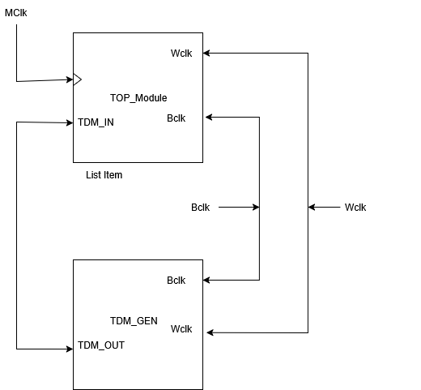

# FPGA Audio Processing Example
An **FPGA-based audio system using Verilog**, featuring TDM input/output, clock generation, and basic audio processing. Includes **testbenches** for simulation and verification.

## Tabel Of Contents
- [Description](#description)
-- [Top Level Diagram](#top-level-diagram)
## Description

The Code is distributed into two Core sections. The **top** Module and **tdm_gen**.
**tdm_gen** Module generates a **Serial** Signal that is **De-Multiplexed** into **Ch_1** and **Ch_2** internally, Applied a transformation (e.g., gain, mute, filtering, etc.) and is then converts parallel samples back into a **Serial TDM stream**.

----

### Top Level Diagram 

## Files

- top.v  
Top Module  
- audio_clkgen.v  
Audio Clock Generation Module  
- tdm_input.v  
TDM Input Module  
- tdm_output.v  
TDM Output Module
- audio_processing.v  
Audio Processing State Machine Example
- tdm_gen.v  
TDM Signal Generator (Simulation Only)
- tb_top.v  
Testbench for whole system
- tb_tdm_input.v  
Testbench of tdm_input module
